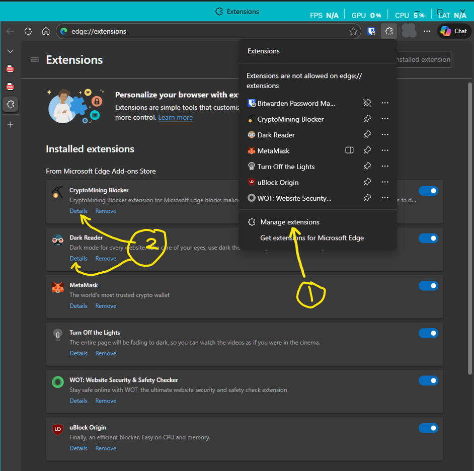
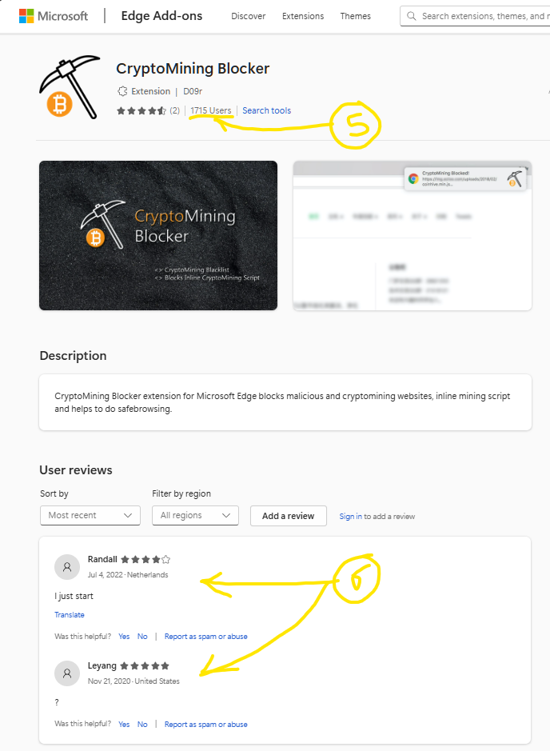
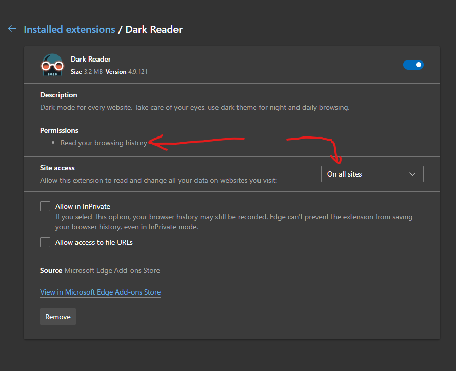
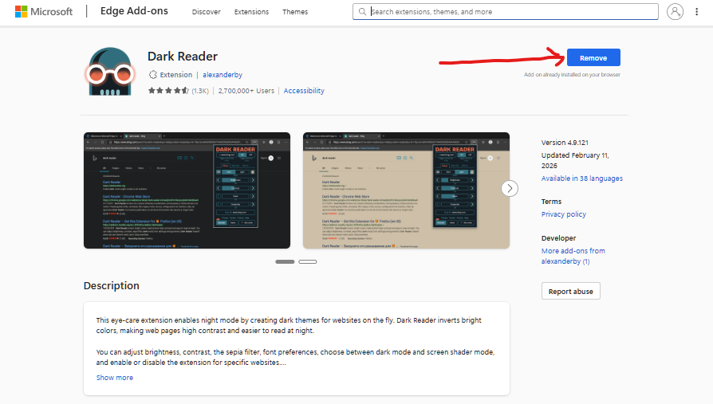

# Identify and Remove Suspicious Browser Extensions

## 📌 Objective
The goal of this project is to learn how to identify potentially harmful browser extensions in Microsoft Edge, evaluate their permissions and reputation, and remove those that pose risks to security, privacy, and performance. This exercise demonstrates practical awareness of browser hygiene and extension management.

## 🛠️ Setup
- Browser used: **Microsoft Edge**
- Accessed extensions via the **puzzle icon → Manage Extensions**.  
  

## 🎯 Investigation Process
For each installed extension, the following steps were performed:
1. **Check Extension Details** → Review permissions requested.  
2. **Verify Reviews** → Analyze user feedback in the Edge Add-on store.  
3. **Research Online** → Confirm reputation and safety through independent sources.  
4. **Decision** → Keep or remove based on findings.

---

### 🔹 Extension: Cryptomining Blocker
- **Permissions:** Only required *Display notification*.  
    
- **Reviews:** Positive feedback, large user base.  
    
- **Research:** Confirmed safe via Google search.  
- **Decision:** ✅ Kept installed.

---

### 🔹 Extension: Dark Reader
- **Permissions:** Required *Browsing history access*.  
    
- **Analysis:** Theme-based extensions technically don’t need browsing history, but in Edge/Chrome/Firefox this permission is bundled.  
- **Reviews:** 50k+ users, but one flagged it as malware.  
    
- **Research:** ***While Dark Reader is a popular extension for enabling dark mode on websites, there have been significant concerns regarding its safety, including reports of malware and adware associated with it.***  
- **Decision:** ❌ Removed immediately for safety.  
  

---

### 🔹 Extension: Turn Off the Lights
- **Permissions:** Required *Browsing history access*.  
- **Usage:** Rarely used, added unnecessary load.  
- **Decision:** ❌ Removed to improve performance and reduce risk.

---

## 🔍 Key Findings
- Safe extensions can be confirmed by checking permissions, reviews, and external research.  
- Suspicious extensions often request elevated permissions (like browsing history) that can be abused.  
- Even popular extensions may hide risks — malware often masquerades as useful tools until activated.  
- Removing unused or suspicious extensions improves both **security** and **browser performance**.

---

## ⚠️ Risks of Malicious Extensions
Malicious browser extensions can:
- Steal sensitive data and credentials.
- Track user behavior across websites.
- Inject unwanted ads or redirect traffic.
- Operate persistently in the background with elevated privileges.
- Enable data theft, corporate espionage, and system compromise.
- Manipulate web content, exploit networks, and profile users.

These risks highlight why extensions should be treated with the same caution as software installations.

---

## ✅ Best Practices for Extension Management
- Install extensions only from official browser stores.  
- Review permissions carefully before enabling.  
- Regularly audit installed extensions and remove unused ones.  
- Research extensions online for reputation and security concerns.  
- Enable browser updates to patch vulnerabilities.  
- Combine with **MFA** and strong password practices for layered security.

---

## 📊 Conclusion
By systematically reviewing permissions, user feedback, and external research:
- We identified safe extensions worth keeping.  
- We removed suspicious ones to reduce risk.  
- This project demonstrates practical skills in **browser security awareness**, **risk management**, and **performance optimization**.

This exercise reinforces the importance of proactive defense in everyday browsing, showing how small steps like extension management can prevent larger compromises.

---
